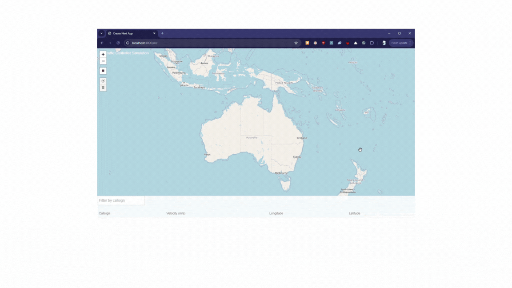

# Mission Control

**Mission Control** is a real-time aircraft tracking application that fetches Automatic Dependent Surveillance Broadcasting (ADS-B) data from the OpenSky API. This data is relayed to a Next.js dashboard that features an interactive map, enabling users to track commercial aircraft in near real-time.

# Demo

## Features

- **Real-time Tracking:** Visualize aircraft movements on a dynamic map using ADS-B data.
- **Data Relay:** Utilizes RabbitMQ to efficiently pass data from the OpenSky integration to a FastAPI backend.
- **Next.js Dashboard:** A user-friendly interface for displaying tracking data.

## Work in Progress

This project is currently under development, and future updates will include integration of additional data sources beyond ADS-B. Check back for updates!

## License

This project is licensed under the MIT License.

